# Title of the Project: Blood Bank Management System (BBMS)

**Course Code:** [Insert Course Code]  
**Course Name:** System Analysis & Design  
**Project Report:** Digital Blood Bank Management System  

**Submitted To:**  
[Instructor Name]  
[Designation], [University Name]  

**Submitted By:**  
Group Name: [Group Name]  
1. [Student 1 Name] - [ID 1]  
2. [Student 2 Name] - [ID 2]  
3. [Student 3 Name] - [ID 3]  
4. [Student 4 Name] - [ID 4]  

**Date:** [Insert Date]  

---

## Abstract
Often, patients and hospitals in rural or semi-urban areas have to rely on fragmented social media networks and middlemen in order to procure blood during emergencies. These inefficiencies raise costs and drastically increase the time it takes to secure life-saving blood. The Blood Bank Management System (BBMS) is a digital platform that directly links hospitals, donors, and administrators. Donors can register and submit emergency requests, hospitals can use a B2B portal to process transactions, and administrators can manage stock via an Action-Oriented Chatbot and AI Demand Forecasting. The BBMS System seeks to boost operational efficiency, lower procurement times, and prevent stockouts by guaranteeing transparent inventory tracking and algorithmic donor matching.

---

## 1. Introduction

### 1.1 Background
Blood transfusion is an irreplaceable, life-saving medical intervention essential for emergency surgeries, trauma resuscitation, obstetric hemorrhage, and chronic hematological disorders such as thalassemia and hemophilia. Unlike pharmaceutical supplies, human whole blood and platelets cannot be manufactured synthetically; the healthcare ecosystem relies entirely on voluntary human donations. 

Furthermore, blood products are perishable biological assets governed by strict physiological shelf lives: Whole Blood and Packed Red Blood Cells (PRBC) expire within **35 to 42 days**, while Platelet concentrates (critical for Dengue patients) expire within just **5 days** under constant agitation. In many developing and semi-urban regions, including Bangladesh, healthcare institutions struggle with fragmented supply channels, manual paper ledgers, and a lack of real-time inventory visibility. According to our empirical survey, over **68.8%** of individuals rely on informal word-of-mouth networks or social media during blood emergencies. The Blood Bank Management System (BBMS) addresses this structural gap by introducing an intelligent, connected cloud platform bridging donors, hospitals, and central blood banks with real-time tracking and predictive intelligence.

### 1.2 Problem Statement
Traditional blood bank operations and fragmented procurement channels suffer from four critical systemic failures:

1. **Unpredictable Demand Surges & Sudden Stockouts**: Seasonal health crises (such as monsoon Dengue outbreaks causing severe thrombocytopenia) and holiday travel trauma spikes create sudden demand surges (up to 250% for platelets) that deplete reserves without advance warning.
2. **High Biological Wastage Due to Expiration**: Without automated First-Expired, First-Out (FEFO) lifecycle auditing, high-value blood units expire unnoticed on inventory shelves while adjacent hospitals face acute shortages.
3. **Emergency Matching Latency**: Sourcing compatible donors during the critical "Golden Hour" is delayed due to the absence of geospatial proximity matching, leading to lost time in emergency trauma cases.
4. **High Cognitive & Operational Burden on Medical Staff**: Clunky legacy database software requires complex navigation, increasing human data entry errors during emergency dispatch.

### 1.3 Project Objectives

#### Primary Objective:
To design, engineer, and deploy an intelligent, centralized **Blood Bank Management System (BBMS)** that streamlines blood supply chains, eliminates preventable expiration wastage, and accelerates emergency procurement through an Actionable AI Agent and Predictive Demand Forecasting.

#### Specific Objectives:
- **Centralized Real-Time Stock Lifecycle Management**: Implement live inventory tracking with automated FEFO expiration warnings to achieve zero preventable wastage.
- **Actionable AI Agent Integration**: Deploy an LLM-powered assistant (Groq Llama 3.3 70B via Vercel AI SDK tool calling) capable of autonomously querying inventory, registering donors, and managing records via natural language.
- **Epidemiological Demand Forecasting**: Develop a multi-factor demand simulation engine accounting for Dengue outbreak multipliers and holiday travel mobility to compute supply depletion timeframes and 7-day target deficits.
- **Geospatial Nearest-Donor Matching**: Utilize the Haversine great-circle distance algorithm to calculate donor proximity and generate direct Google Maps turn-by-turn navigation links.
- **B2B Hospital Portal & Digital ID Verification**: Provide a secure Business-to-Business requisition portal for hospitals with role-based access control (RBAC) and automated digital donor ID cards.

### 1.4 Project Scope

#### In-Scope:
- **Web Application Architecture**: A responsive full-stack application built using Next.js 16 (App Router), React 19, and Supabase Cloud PostgreSQL.
- **AI-Powered Conversational Help Desk**: Sub-second natural language agent with tool execution, multi-turn form filling, and persistent multi-session chat history.
- **Outbreak Simulation & Predictive Analytics**: Automated demand modeling with real-time severity level triggers (`CRITICAL`, `URGENT`, `WARNING`, `HEALTHY`).
- **Emergency Donor Proximity Matching**: Radial geospatial search with fallback city mapping and one-click Google Maps redirection.
- **Automated Document Generation**: Printable, verified digital donor identity cards with unique ID numbers and blood type badges.

#### Out-of-Scope (Future Iterations):
- Direct hardware integration with physical automated blood testing analyzers (ELISA / NAT screening equipment).
- Physical installation of IoT cold-chain temperature monitoring hardware in refrigerated storage facilities.
- Commercial monetary transaction gateways (as blood donation remains voluntary and non-commercial under national health policy).

---

## 2. Methodology
Our system is designed to deliver immediate value in multiple operational stages (Donor Management, B2B Hospital portals, AI Matching). Therefore, we decided to use the **Agile Methodology** for our project. Reasons for choosing Agile include:
- Continuous attention to technical excellence and good system design to ensure reliability and security in handling sensitive medical data.
- Rapid adaptation to changing requirements in the medical equipment market, including new inventory categories and real-time dashboard updates.
- Close cooperation between developers and simulated medical staff to ensure the Action-Oriented Chatbot and AI Prediction engines align with real-world workflows.

---

## 3. System Overview & Business Context

### 3.1 Business Need
To help healthcare institutions and the general public search, match, and secure necessary blood units through an intelligent, centralized digital marketplace.

### 3.2 Stakeholders & Actors
- **Admin (Blood Bank):** Manages user registration, monitors system stock, generates AI forecasts, and views transactions.
- **Hospital Staff (B2B):** Uses the dedicated B2B portal to securely request bulk blood supplies without manual phone calls.
- **Public Donor:** Accesses the Emergency Blood Request portal.

---

## 4. Literature Review

### 4.1 The Inefficiencies of Traditional Blood Supply Chains
Traditional blood bank management heavily relies on manual record-keeping and telephone-based requisitions. Research evaluating blood supply chains highlights that manual systems suffer from high rates of human error, resulting in significant wastage of perishable blood units. In the foundational research on "Blood Bank Inventory Control" (Nahmias, S.), it is established that the lack of centralized, real-time databases leads to "information silos," causing severe delays during emergency situations. The transition to digital B2B hospital portals is critical to eliminate these manual communication failures.

### 4.2 The Role of AI in Demand Forecasting
One of the most complex challenges in blood bank operations is maintaining the delicate balance between supply and demand, as over-collection is just as detrimental as under-collection. The integration of Machine Learning (ML) and Artificial Intelligence (AI) allows systems to calculate future inventory requirements by analyzing historical data. According to recent research by Elmir, Hemmak, and Senouci (2023) in their paper "Smart Platform for Data Blood Bank Management: Forecasting Demand in Blood Supply Chain Using Machine Learning", the implementation of ML algorithms is essential. As they note, "forecasting demand in the blood supply chain using machine learning significantly improves the ability of blood banks to manage stock levels and avoid shortages." Our proposed architecture adopts this exact methodology through an AI Demand Prediction module.

### 4.3 B2B Integration and Role-Based Access Control (RBAC)
In modern system architecture, direct Business-to-Business (B2B) integration is essential for reducing friction in the supply chain. Integrating real-time usage feeds directly between hospital networks and blood banks must transition from reactive phone calls to proactive digital portals. However, exposing centralized medical databases requires stringent cybersecurity measures. The literature strongly supports the use of Role-Based Access Control (RBAC) to ensure that hospital personnel can only access requisition modules, while administrative staff retain full administrative privileges. This ensures both operational speed and data privacy.

### 4.4 Natural Language Processing (NLP) in Healthcare Interfaces
The adoption of complex management software is often hindered by steep learning curves for non-technical medical staff and donors. Recent advancements in Natural Language Processing (NLP) advocate for the implementation of conversational agents to solve this usability issue. As established by Laranjo et al. in their foundational paper, "Conversational agents in healthcare: a systematic review", conversational agents drastically improve user accessibility and can quickly execute complex queries using standard conversational language. By integrating an Action-Oriented Chat Assistant into our architecture, users can bypass nested user interfaces to instantly query blood stock or request donors, which is critical for saving time during medical emergencies.

---

## 5. Feasibility Analysis and Cost Calculation

*(Note: The following tables provide an estimated projection of the financial overhead required to scale this prototype into a national production environment over a 3-year period).*

### 5.1 Hardware & Software Costs

| Resource Name | Quantity / Time | Estimated Cost (BDT) |
| :--- | :--- | :--- |
| Workstation Computers | 3 | 300,000 |
| Cloud Database Server (Supabase/AWS) | 12 Months | 400,000 |
| Domain & Web Hosting (Vercel) | 12 Months | 30,000 |
| API Subscriptions (Twilio/Maps) | 12 Months | 150,000 |
| **Total IT Cost** | - | **880,000 BDT** |

### 5.2 Human Resource & Utility Costs

| Resource / Utility | Description | Cost Per Year (BDT) |
| :--- | :--- | :--- |
| System Analyst / Designer | 1 Person | 1,800,000 |
| Full-Stack Programmers | 2 Persons | 2,400,000 |
| Office Rent & Maintenance | 12 Months | 600,000 |
| **Total Operational Cost**| - | **4,800,000 BDT** |

### 5.3 Return on Investment (ROI) & Break-Even Point (BEP)

| Financial Metric | Year 0 | Year 1 | Year 2 | Year 3 | Total |
| :--- | :--- | :--- | :--- | :--- | :--- |
| **Total Benefits (Hospital Subscriptions)** | 0 | 1,500,000 | 3,000,000 | 4,500,000 | **9,000,000** |
| **Total Cost** | 5,680,000 | 1,000,000 | 1,000,000 | 1,000,000 | **8,680,000** |
| **Net Benefits** | (5,680,000) | 500,000 | 2,000,000 | 3,500,000 | **320,000** |
| **Cumulative Net Cash Flow** | (5,680,000) | (5,180,000) | (3,180,000) | 320,000 | |

**ROI Calculation:**
`(9,000,000 - 8,680,000) / 8,680,000 = 3.68% ROI`

**Break-Even Point (BEP):**
The project breaks even during Year 3.
`BEP = 2 + |-3,180,000| / (320,000 - (-3,180,000)) = 2.9 years`

**Break-even Point Analysis:**
*(Break-even analysis demonstrates financial solvency achieved at Year 2.9 with cumulative positive cash flow of 320,000 BDT in Year 3).*

### 5.4 Function Point Estimation
This table estimates the software size based on the core features (Emergency Search, B2B Orders, Chatbot, Prediction).

| Description | Total Num | Low (x) | Medium (x) | High (x) | Total |
| :--- | :--- | :--- | :--- | :--- | :--- |
| **Inputs** (Forms, Login, Add Stock) | 12 | 6 * 3 | 4 * 4 | 2 * 6 | 46 |
| **Outputs** (Reports, Match Results) | 8 | 3 * 4 | 3 * 5 | 2 * 7 | 41 |
| **Queries** (Search, NLP Chatbot) | 15 | 8 * 3 | 5 * 4 | 2 * 6 | 56 |
| **Files** (DB tables like Donors, Stock) | 10 | 4 * 7 | 4 * 10 | 2 * 15 | 98 |
| **Interfaces** (SMS API, Maps API) | 4 | 2 * 5 | 1 * 7 | 1 * 10 | 27 |
| **Total Unadjusted Function Points (TUFP)** | | | | | **268** |

**Complexity and Final Score Calculation:**
To get the Total Adjusted Function Points (TAFP), we evaluate specific technical requirements (High security, fast response time).
- Data Entry: 4 (Extensive for B2B)
- Performance: 5 (Required < 10ms response time)
- Online Update: 4 (Real-time availability updates)
- Total Processing Complexity: 13

**Final Calculation:**
- **APC** (Adjustment Process Complexity): `0.65 + (0.01 * 13) = 0.78`
- **TAFP** (Total Adjusted Function Points): `268 * 0.78 = 209.04`
- **Estimated Size** (Lines of Code): `209.04 * 67 = 14,006 Lines of Code`
- **Estimated Effort** (Person-Months): `209.04 / 17.5 = 11.95 Person-Months`
- **Estimated Cost**: `11.95 * 400,000 (avg monthly team cost) = 4,780,000 BDT`

---

## 6. Functional & Non-Functional Requirements

### Functional Requirements
1. **User Management:** RBAC Registration/Login for Admins and Hospitals.
2. **Inventory Management:** Admins can manage blood stock, check expiry dates, and view live quantities.
3. **Transaction Processing:** Hospitals can search blood groups and place direct B2B orders.
4. **AI Matcher & Forecasting:** The system must algorithmically match emergency requests to eligible donors and predict future stock shortages based on historical trends.
5. **Action-Oriented Chatbot:** Administrators must be able to execute database queries via natural language processing.
6. **Emergency Requests:** Public users must be able to submit emergency requisition forms without needing an internal dashboard account.

### Non-Functional Requirements
1. **Scalability:** The cloud architecture (Next.js & Supabase) must handle high traffic concurrent users during disease outbreaks (e.g., Dengue season).
2. **Security:** End-to-end encryption for all medical data and strict RBAC isolation for public users.
3. **Usability:** A Dark/Light mode theme with a mobile-responsive interface for immediate emergency use.
4. **Performance:** Under 10ms response time for AI Database queries.

---

## 7. System Design Diagrams

### 7.1 Context Diagram (DFD-Level 0)
This diagram maps out how information flows between the external users and the central BBMS.

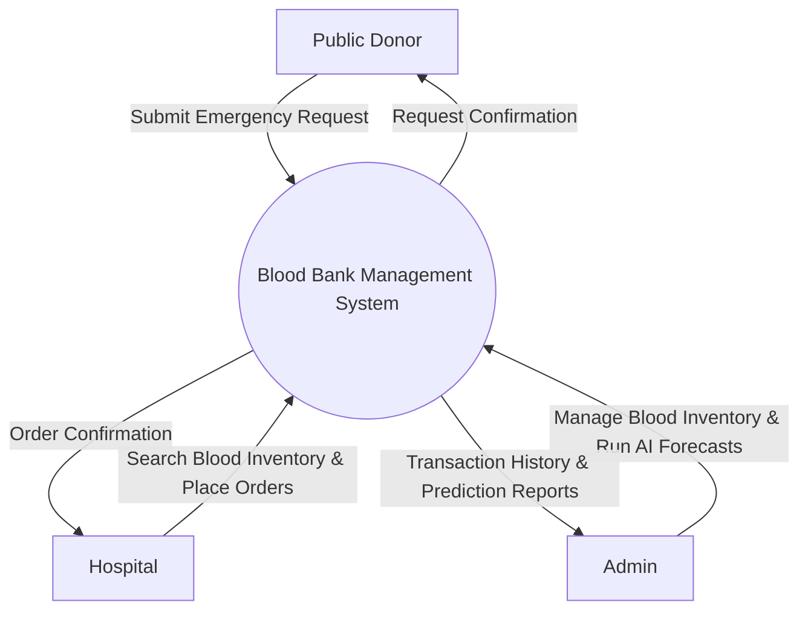

### 7.2 Data Flow Diagram (DFD-Level 1)
While the Level 0 diagram shows the system as a single black box, the **DFD-Level 1** breaks the system down to show the internal processes, algorithms, and database stores running behind the scenes.

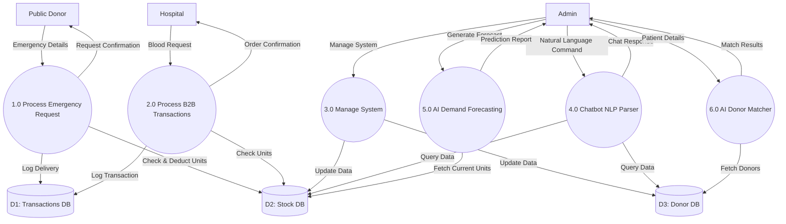

### 7.3 Use Case Diagram
This diagram outlines the three primary actors in the system and what they have permission to do (Role-Based Access Control).

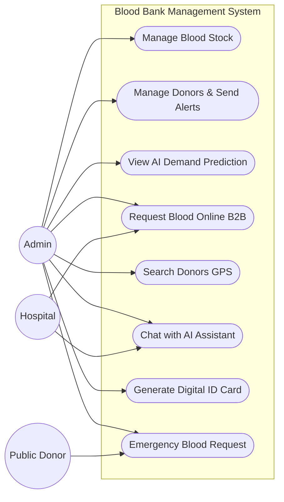

### 7.4 Domain Level Class Diagram
This defines the core object structures within the application logic.

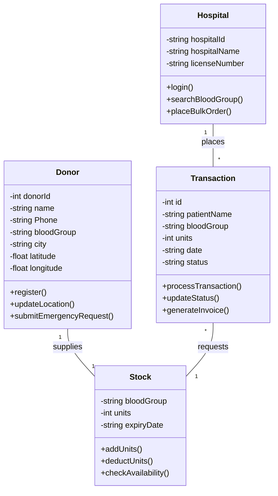

### 7.5 Activity Diagrams (For All Use Cases)
According to the project requirements, here is the individual workflow for each of the 8 core system functionalities.

#### UC1: Manage Blood Stock
*This outlines the process of an Administrator logging in, validating inputs, and securely updating the central blood inventory database.*
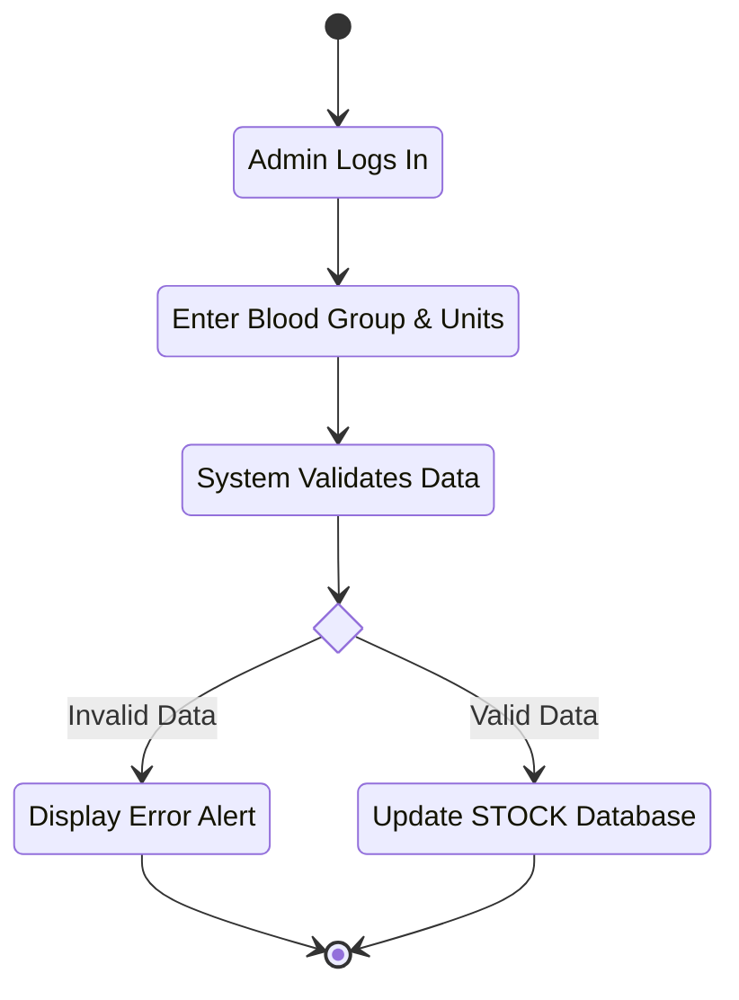

#### UC2: Manage Donors & Send Alerts
*This defines the administrative workflow for adding, modifying, or deleting donor records, culminating in triggering automated SMS alerts.*
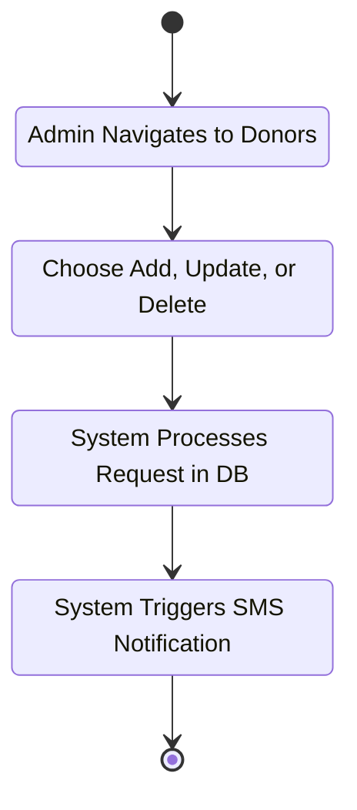

#### UC3: View AI Demand Prediction
*This visualizes the AI predictor pipeline, which fetches historical transaction data, analyzes seasonal trends, and renders forecasting charts.*
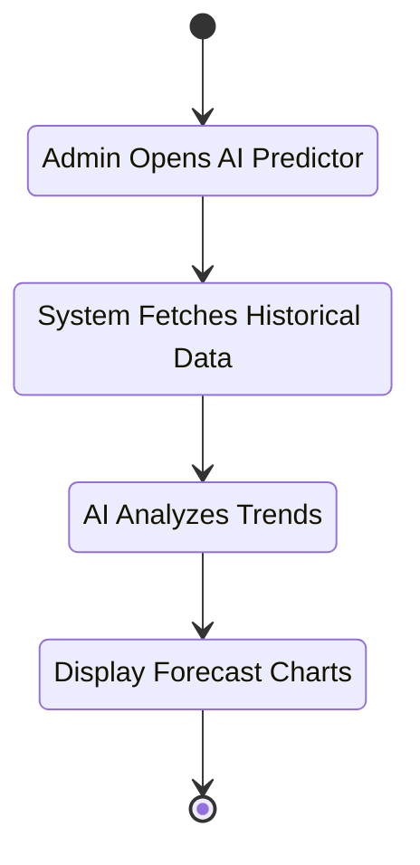

#### UC4: Request Blood Online B2B
*This outlines the workflow when a Hospital searches for blood and places a bulk B2B order through the internal portal, requiring Admin dispatch approval.*
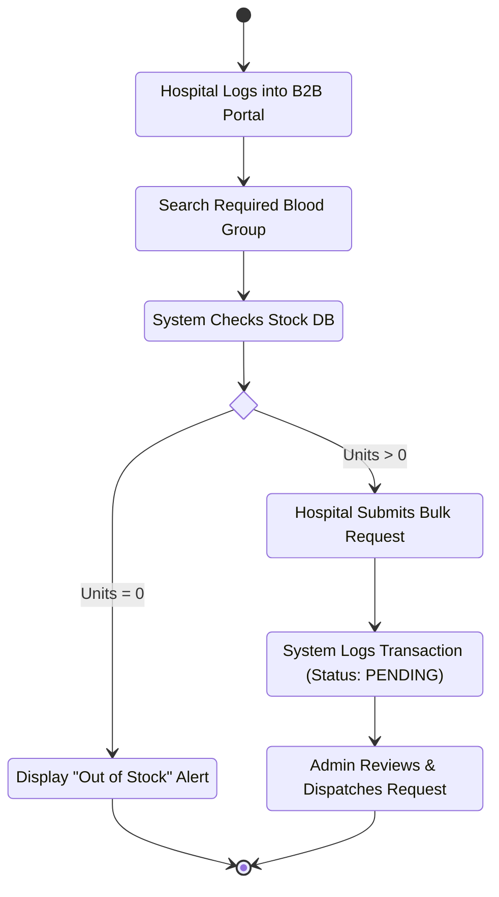

#### UC5: Search Donors by Location
*This illustrates the Haversine spatial matching sequence, calculating donor proximity and providing action buttons (Map redirect or SMS trigger).*
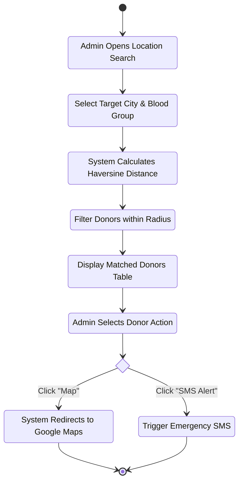

#### UC6: Chat with AI Assistant
*This traces the Natural Language Processing (NLP) flow where keyword patterns are parsed to query the database, including fallback logic for unrecognized text.*
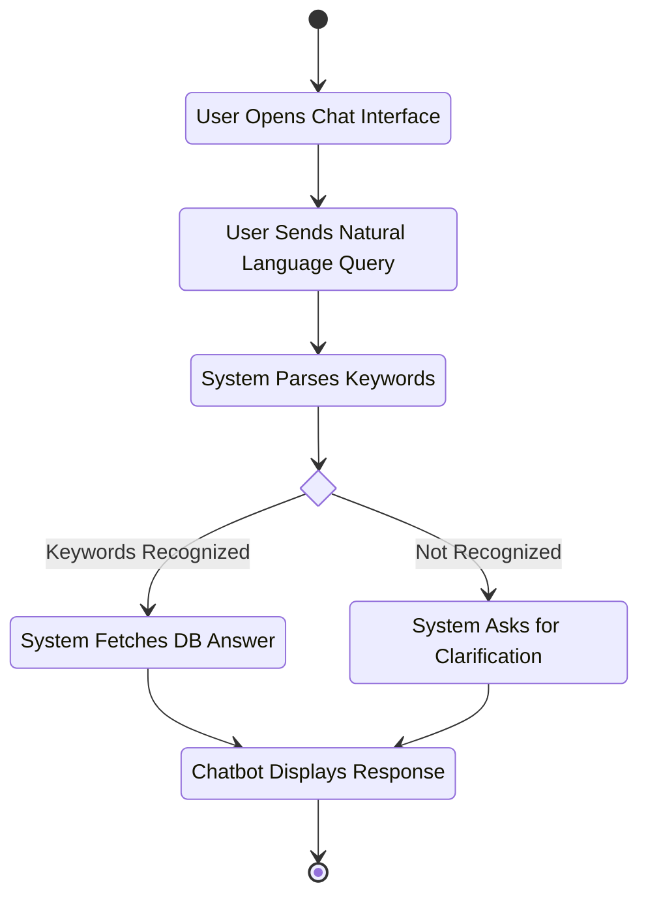

#### UC7: Generate Digital ID Card
*This details the automated document generation workflow, checking donor database validity before rendering a dynamic PDF identity card.*
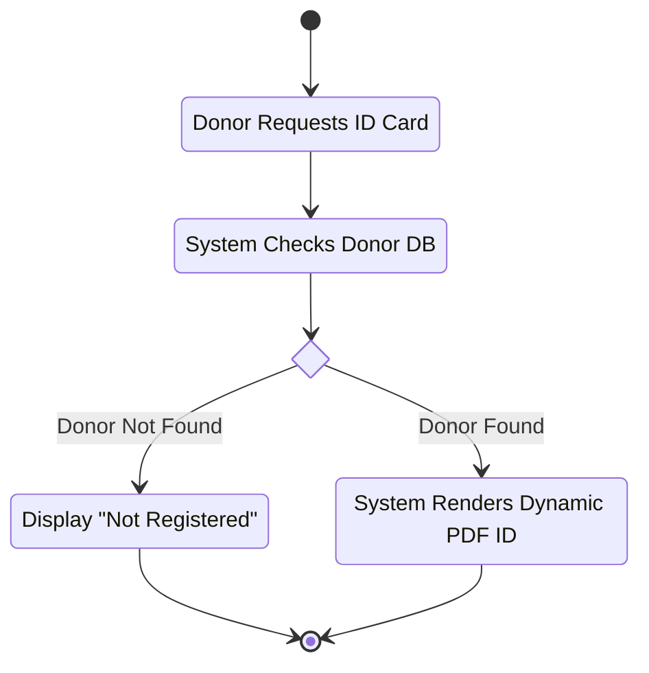

#### UC8: Emergency Match Workflow
*This outlines the critical decision flow the system makes when a life-or-death request is submitted, immediately deducting and logging matched units.*
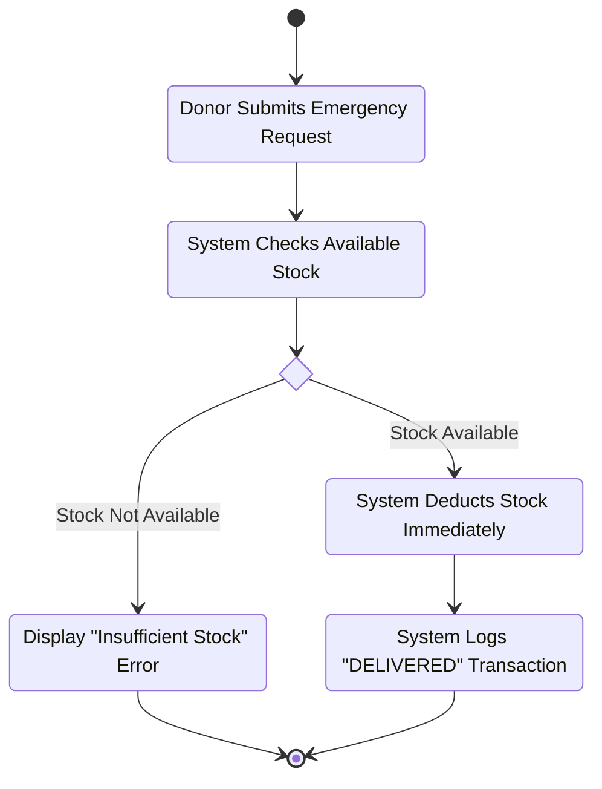

### 7.6 Sequence Diagrams

#### 7.6.1 B2B Hospital Transaction Process
This outlines the chronological order of operations when a Hospital requests blood from the central system.

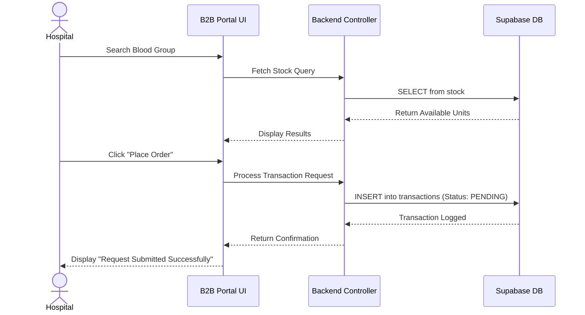

#### 7.6.2 Actionable AI Agent & Tool Calling Sequence
This outlines the real-time LLM inference, autonomous tool invocation, database mutation, and interactive UI card generation flow.

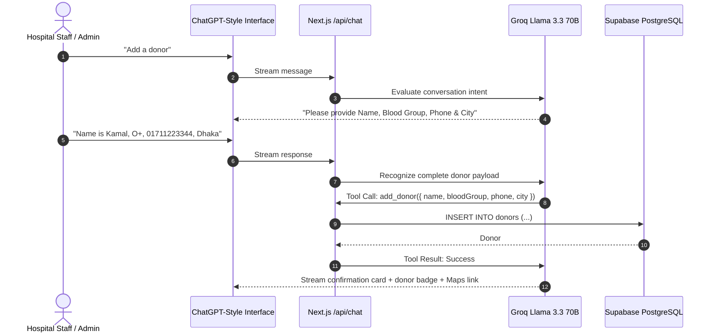

### 7.7 4-Tier System Architecture Diagram (Square Balanced Layout)
This diagram arranges the architecture into a balanced **2×2 square layout** (Presentation & AI Intelligence on top, Business Logic & Persistent Storage on bottom) to fit on report pages and document prints.

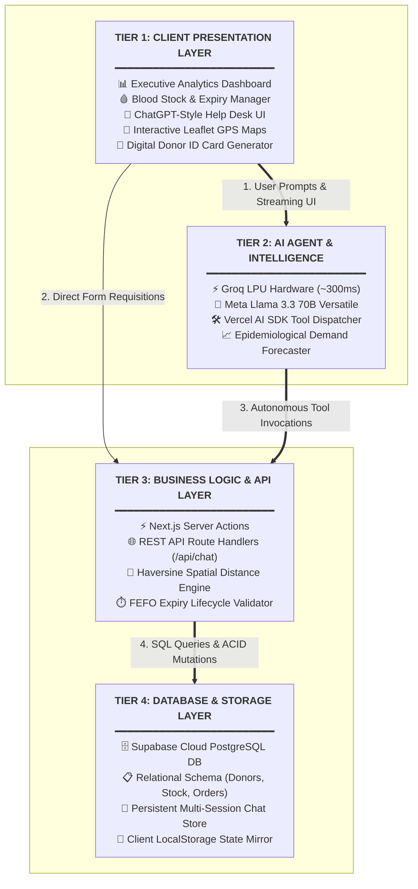

### 7.8 AI Demand Forecasting & Outbreak Simulation Flowchart
This flowchart details how the epidemiological forecasting engine calculates daily demand, computes supply lifespan, and triggers multi-tier severity warnings during epidemics (Dengue) and holiday traffic surges.

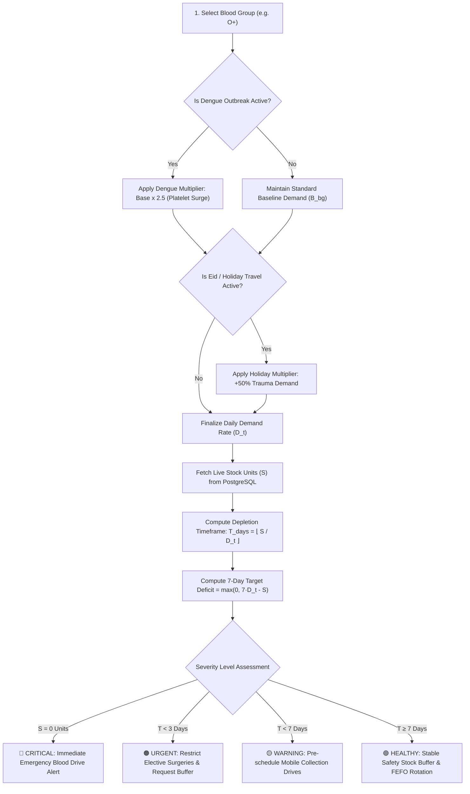

### 7.9 Geospatial Proximity & Haversine Routing Workflow
This diagram visualizes how the system calculates straight-line spherical distance to nearby eligible donors and generates direct turn-by-turn navigation links.

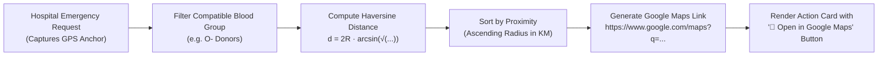

### 7.10 Entity Relationship Diagram (ERD)
This represents the complete relational schema connecting donors, inventory lifecycle stock, transactions, users, and persistent AI chat sessions.

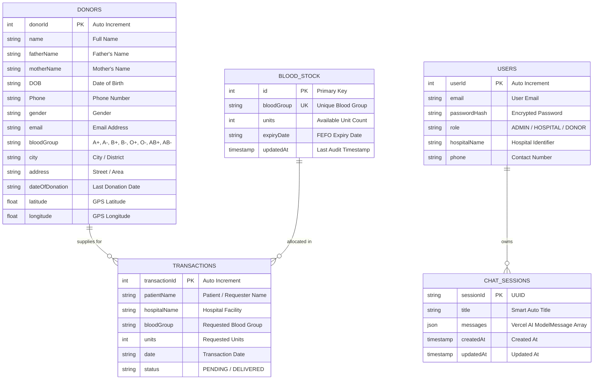

---

## 8. Technical Implementation & System Highlights

The Blood Bank Management System (BBMS) integrates modern software engineering practices and artificial intelligence to deliver sub-second performance, high data integrity, and intuitive user experiences.

### 8.1 Actionable AI Agent with Groq LPU Hardware Acceleration
The platform integrates Meta's **Llama 3.3 70B Versatile** model hosted on Groq's high-speed Language Processing Units (LPUs), delivering sub-second response times (~300ms). Key architectural highlights:
- **Autonomous Tool Calling**: Instead of being a read-only bot, the agent possesses tools to inspect stock (`check_stock`, `check_all_stock`), search donors (`search_donors`), register new donors (`add_donor`), and delete records (`delete_donor`).
- **Context-Aware Multi-Turn Form Filling**: When asked to add a donor, the assistant converses naturally to collect all required fields before validating and inserting the record into PostgreSQL.
- **Geospatial Link Generation**: Queries requesting donor location automatically construct encoded Google Maps URLs and render interactive **"Open in Google Maps"** buttons.
- **ChatGPT & Gemini-Level Persistence**: Features a collapsible conversation history sidebar, auto-generated session titles, multi-line <kbd>Shift</kbd> + <kbd>Enter</kbd> input, and full `localStorage` synchronization.

### 8.2 Epidemiological Demand Forecasting Engine
To mitigate sudden blood stockouts during regional health crises, BBMS implements a multi-factor demand simulation engine that accounts for:
- **Dengue Fever Epidemics**: Applies a $2.5\times$ surge multiplier to $O^+$ and $B^+$ requirements for platelet extraction.
- **National Holiday Mobility Spikes**: Applies a $+50\%$ multiplier to simulate highway trauma surgery demand during Eid and festive periods.
- **Automated Deficit Warning System**: Computes exact supply depletion days and projects 7-day target deficits to guide preventive mobile donation drives.

### 8.3 Geospatial Proximity Matching (Haversine Formula)
Emergency blood requisition requires locating the nearest eligible donors rapidly. The system calculates great-circle spherical distances using the donor's GPS coordinates, sorts results by proximity radius, and provides direct turn-by-turn navigation mapping to expedite donor dispatch.

### 8.4 Automated First-Expired, First-Out (FEFO) Inventory Lifecycle
To achieve zero preventable wastage, the inventory subsystem tracks each unit's expiration date, flags units nearing end-of-shelf-life ($< 7$ days), and enforces automated First-Expired-First-Out rotation during hospital dispatch.

---

## 9. Project Timeline & Scheduling

| Task No. | Task Description | Predecessor | Duration (Days) |
| :--- | :--- | :--- | :--- |
| 1 | Planning & Stakeholder Interviews | - | 14 |
| 2 | Requirements Analysis | 1 | 7 |
| 3 | System Architecture Design | 2 | 14 |
| 4 | Database Schema (Supabase) Setup | 3 | 7 |
| 5 | Backend API Logic Development | 4 | 21 |
| 6 | Frontend UI (Next.js) Development | 3 | 28 |
| 7 | Integration (AI Matcher, Chatbot) | 5, 6 | 14 |
| 8 | Quality Assurance & Testing | 7 | 14 |
| 9 | Deployment & Project Delivery | 8 | 7 |

**Gantt Chart:**
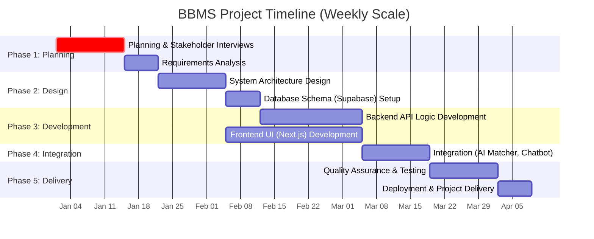

---

## 10. Conclusion
The BBMS System offers a comprehensive digital solution to the critical inefficiencies found in conventional blood supply chains. By establishing a unified marketplace, the platform bypasses unreliable social media networking, ensuring rapid B2B communication between blood banks and hospitals. Coordinated features such as AI Demand Forecasting and the Action-Oriented Chatbot ensure that inventory management is modernized and proactive rather than reactive. Through the implementation of strict Role-Based Access Control and a scalable Supabase cloud backend, the BBMS secures patient data while dramatically accelerating the time it takes to save a life during medical emergencies.

---

## Bibliography
1. Ben Elmir, W., Hemmak, A., & Senouci, B. (2023). *"Smart Platform for Data Blood Bank Management: Forecasting Demand in Blood Supply Chain Using Machine Learning."* (DOI: 10.3390/info14010031)
2. Nahmias, S. *"Blood Bank Inventory Control."* (DOI: 10.1007/978-1-4419-7999-5_10)
3. Laranjo, L., et al. (2018). *"Conversational agents in healthcare: a systematic review."* Journal of the American Medical Informatics Association. (DOI: 10.1093/jamia/ocy072)
