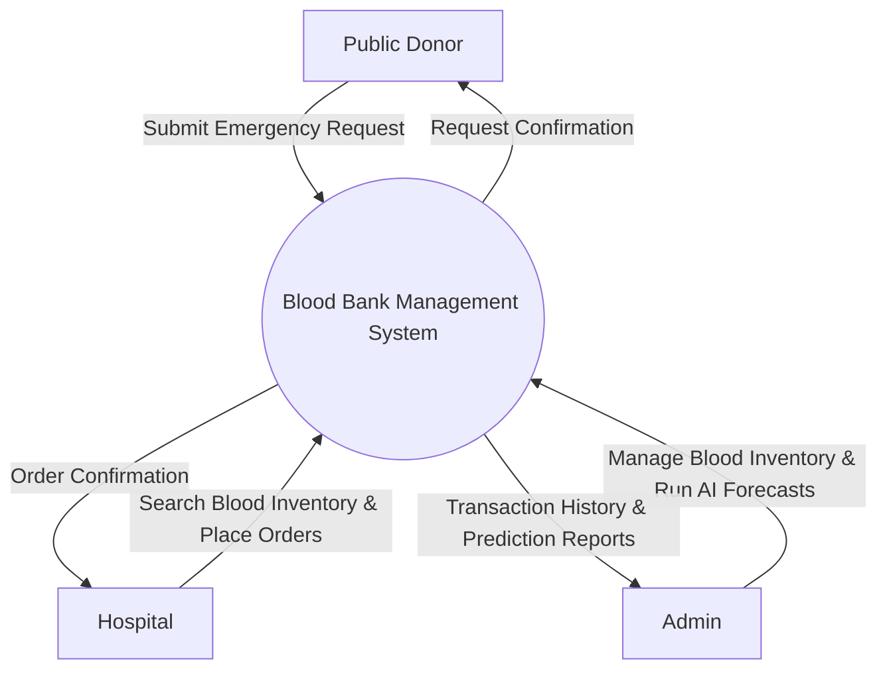
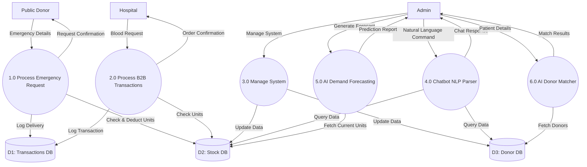
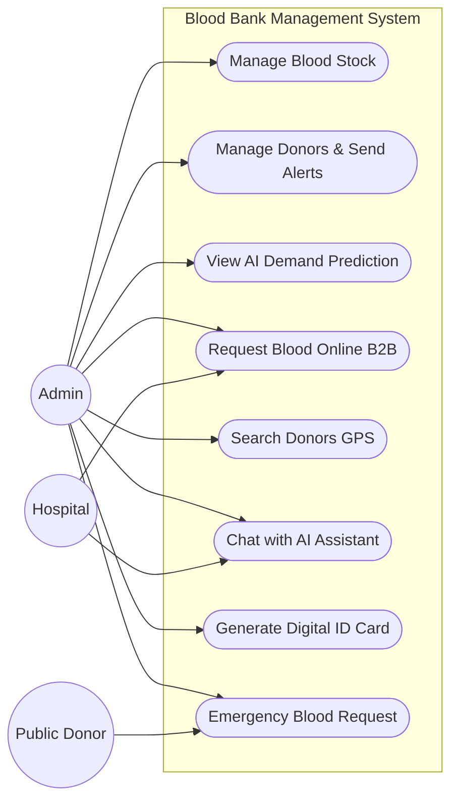
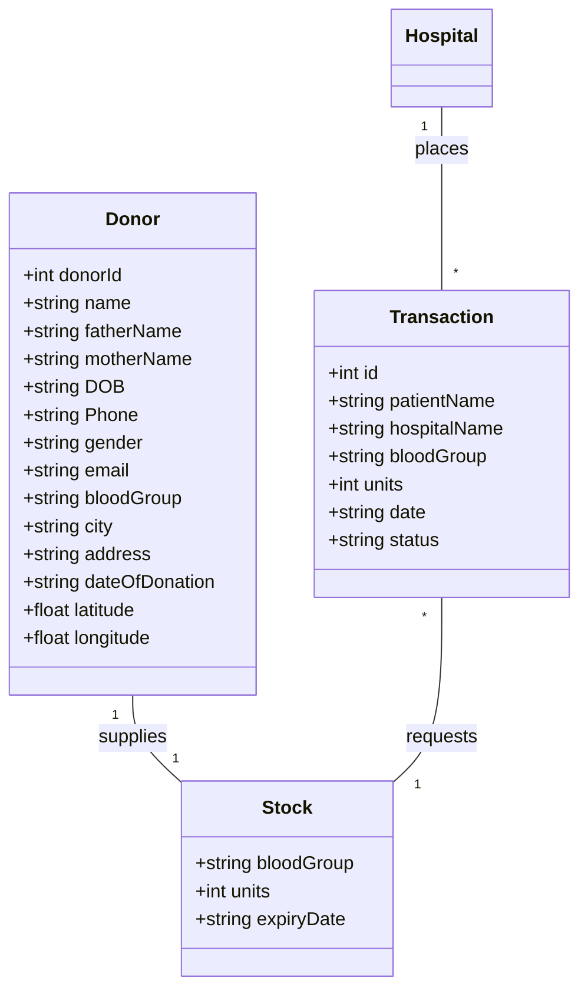
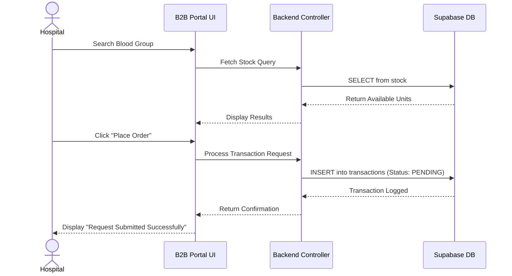
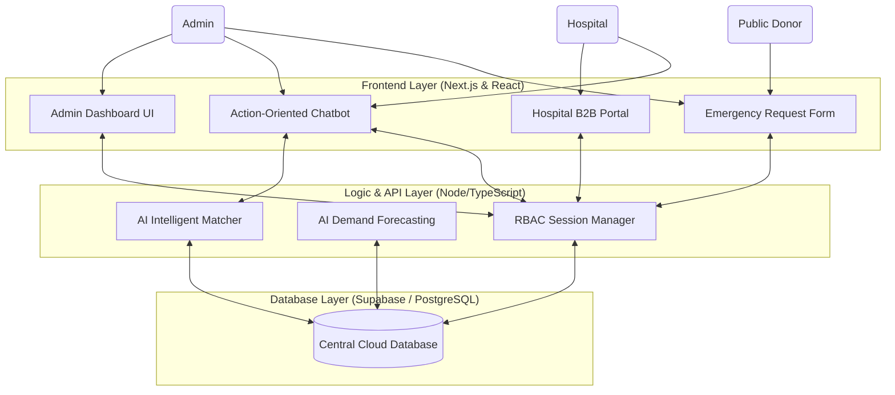
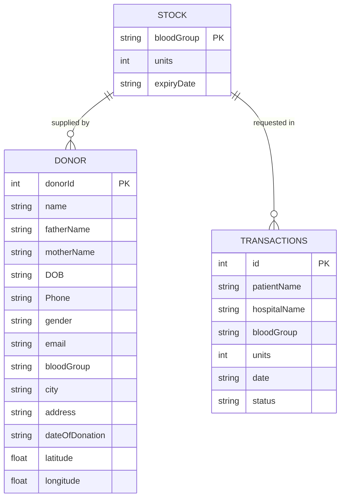
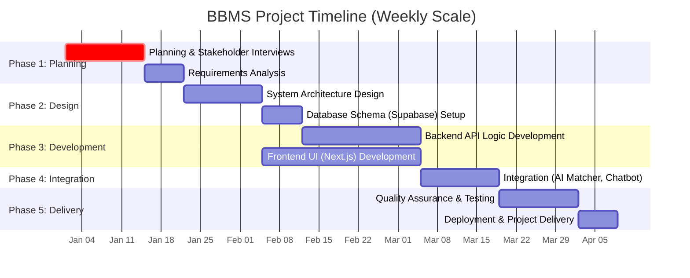

# Title of the Project: Blood Bank Management System (BBMS)

**Course Code:** [Insert Course Code]  
**Course Name:** System Analysis & Design  
**Project Report:** Digital Blood Bank Management System  

**Submitted To:**  
[Instructor Name]  
[Designation], [University Name]  

**Submitted By:**  
Group Name: [Group Name]  
1. [Student 1 Name] - [ID 1]  
2. [Student 2 Name] - [ID 2]  
3. [Student 3 Name] - [ID 3]  
4. [Student 4 Name] - [ID 4]  

**Date:** [Insert Date]  

---

## Abstract
Often, patients and hospitals in rural or semi-urban areas have to rely on fragmented social media networks and middlemen in order to procure blood during emergencies. These inefficiencies raise costs and drastically increase the time it takes to secure life-saving blood. The Blood Bank Management System (BBMS) is a digital platform that directly links hospitals, donors, and administrators. Donors can register and submit emergency requests, hospitals can use a B2B portal to process transactions, and administrators can manage stock via an Action-Oriented Chatbot and AI Demand Forecasting. The BBMS System seeks to boost operational efficiency, lower procurement times, and prevent stockouts by guaranteeing transparent inventory tracking and algorithmic donor matching.

---

## 1. Introduction

### 1.1 Problem Description
Currently, healthcare networks lack a unified, direct access platform for managing blood supply chains. They rely on manual data entry and disjointed communication tools (like Facebook groups), which suppresses response times during emergencies. According to our primary survey data (32 respondents), 68.8% of individuals rely primarily on asking friends and family during blood emergencies, while only a fractional minority have access to organized blood banks. 

### 1.2 Purpose
The primary purpose of this document is to formally introduce the Blood Bank Management System (BBMS), serving as a comprehensive blueprint for its design, development, and implementation. It establishes a shared understanding of the system's requirements, architectural configuration, and intended functionality among all stakeholders, ensuring that the final solution aligns with the established medical supply chain needs.

### 1.3 Motivation
Blood plays a critical role in modern healthcare systems, directly influencing the quality of emergency treatment and patient care. In many developing regions, including Bangladesh, healthcare institutions often face significant challenges in sourcing specific blood groups due to fragmented supply channels, lack of real-time inventory tracking, and limited transparency in donor availability. As a result, clinics and hospitals frequently struggle to identify the right donors within the critical "golden hour" of an emergency. Although numerous social media groups and disjointed blood banks exist, the absence of a unified platform makes it difficult for healthcare providers to secure blood efficiently. This fragmentation leads to inefficiencies, deadly delays in procurement, and increased operational chaos.

The motivation behind the BBMS is to address these challenges by creating a centralized digital marketplace where all relevant information regarding blood inventory and donor proximity is available in one place. The platform aims to simplify the process of searching, matching, and requesting blood while ensuring transparency in inventory levels. By integrating AI-based GPS matching, detailed stock listings, and B2B hospital portals, the BBMS provides a streamlined solution that supports better decision-making and improves overall efficiency in the healthcare ecosystem.

### 1.3 Document Scope
This document covers the complete system analysis and design phases of the BBMS project, including:
- **Requirements:** Defining the capabilities (Functional/Non-Functional).
- **Design:** Presenting the technical structure (System Architecture), database blueprint (ER and Class Diagrams), and process logic (Sequence and Activity Diagrams).
- **Feasibility & Cost:** Estimating the financial overhead and ROI.
- **Timeline:** Providing a planned schedule for project completion.

---

## 2. Methodology
Our system is designed to deliver immediate value in multiple operational stages (Donor Management, B2B Hospital portals, AI Matching). Therefore, we decided to use the **Agile Methodology** for our project. Reasons for choosing Agile include:
- Continuous attention to technical excellence and good system design to ensure reliability and security in handling sensitive medical data.
- Rapid adaptation to changing requirements in the medical equipment market, including new inventory categories and real-time dashboard updates.
- Close cooperation between developers and simulated medical staff to ensure the Action-Oriented Chatbot and AI Prediction engines align with real-world workflows.

---

## 3. System Overview & Business Context

### 3.1 Business Need
To help healthcare institutions and the general public search, match, and secure necessary blood units through an intelligent, centralized digital marketplace.

### 3.2 Stakeholders & Actors
- **Admin (Blood Bank):** Manages user registration, monitors system stock, generates AI forecasts, and views transactions.
- **Hospital Staff (B2B):** Uses the dedicated B2B portal to securely request bulk blood supplies without manual phone calls.
- **Public Donor:** Accesses the Emergency Blood Request portal.

---

## 4. Literature Review

### 4.1 The Inefficiencies of Traditional Blood Supply Chains
Traditional blood bank management heavily relies on manual record-keeping and telephone-based requisitions. Research evaluating blood supply chains highlights that manual systems suffer from high rates of human error, resulting in significant wastage of perishable blood units. In the foundational research on "Blood Bank Inventory Control" (Nahmias, S.), it is established that the lack of centralized, real-time databases leads to "information silos," causing severe delays during emergency situations. The transition to digital B2B hospital portals is critical to eliminate these manual communication failures.

### 4.2 The Role of AI in Demand Forecasting
One of the most complex challenges in blood bank operations is maintaining the delicate balance between supply and demand, as over-collection is just as detrimental as under-collection. The integration of Machine Learning (ML) and Artificial Intelligence (AI) allows systems to calculate future inventory requirements by analyzing historical data. According to recent research by Elmir, Hemmak, and Senouci (2023) in their paper "Smart Platform for Data Blood Bank Management: Forecasting Demand in Blood Supply Chain Using Machine Learning", the implementation of ML algorithms is essential. As they note, "forecasting demand in the blood supply chain using machine learning significantly improves the ability of blood banks to manage stock levels and avoid shortages." Our proposed architecture adopts this exact methodology through an AI Demand Prediction module.

### 4.3 B2B Integration and Role-Based Access Control (RBAC)
In modern system architecture, direct Business-to-Business (B2B) integration is essential for reducing friction in the supply chain. Integrating real-time usage feeds directly between hospital networks and blood banks must transition from reactive phone calls to proactive digital portals. However, exposing centralized medical databases requires stringent cybersecurity measures. The literature strongly supports the use of Role-Based Access Control (RBAC) to ensure that hospital personnel can only access requisition modules, while administrative staff retain full administrative privileges. This ensures both operational speed and data privacy.

### 4.4 Natural Language Processing (NLP) in Healthcare Interfaces
The adoption of complex management software is often hindered by steep learning curves for non-technical medical staff and donors. Recent advancements in Natural Language Processing (NLP) advocate for the implementation of conversational agents to solve this usability issue. As established by Laranjo et al. in their foundational paper, "Conversational agents in healthcare: a systematic review", conversational agents drastically improve user accessibility and can quickly execute complex queries using standard conversational language. By integrating an Action-Oriented Chat Assistant into our architecture, users can bypass nested user interfaces to instantly query blood stock or request donors, which is critical for saving time during medical emergencies.

---

## 5. Feasibility Analysis and Cost Calculation

*(Note: The following tables provide an estimated projection of the financial overhead required to scale this prototype into a national production environment over a 3-year period).*

### 5.1 Hardware & Software Costs

| Resource Name | Quantity / Time | Estimated Cost (BDT) |
| :--- | :--- | :--- |
| Workstation Computers | 3 | 300,000 |
| Cloud Database Server (Supabase/AWS) | 12 Months | 400,000 |
| Domain & Web Hosting (Vercel) | 12 Months | 30,000 |
| API Subscriptions (Twilio/Maps) | 12 Months | 150,000 |
| **Total IT Cost** | - | **880,000 BDT** |

### 5.2 Human Resource & Utility Costs

| Resource / Utility | Description | Cost Per Year (BDT) |
| :--- | :--- | :--- |
| System Analyst / Designer | 1 Person | 1,800,000 |
| Full-Stack Programmers | 2 Persons | 2,400,000 |
| Office Rent & Maintenance | 12 Months | 600,000 |
| **Total Operational Cost**| - | **4,800,000 BDT** |

### 5.3 Return on Investment (ROI) & Break-Even Point (BEP)

| Financial Metric | Year 0 | Year 1 | Year 2 | Year 3 | Total |
| :--- | :--- | :--- | :--- | :--- | :--- |
| **Total Benefits (Hospital Subscriptions)** | 0 | 1,500,000 | 3,000,000 | 4,500,000 | **9,000,000** |
| **Total Cost** | 5,680,000 | 1,000,000 | 1,000,000 | 1,000,000 | **8,680,000** |
| **Net Benefits** | (5,680,000) | 500,000 | 2,000,000 | 3,500,000 | **320,000** |
| **Cumulative Net Cash Flow** | (5,680,000) | (5,180,000) | (3,180,000) | 320,000 | |

**ROI Calculation:**
`(9,000,000 - 8,680,000) / 8,680,000 = 3.68% ROI`

**Break-Even Point (BEP):**
The project breaks even during Year 3.
`BEP = 2 + |-3,180,000| / (320,000 - (-3,180,000)) = 2.9 years`

**Break-even Point Analysis Graph:**
*(Insert your Break-even Graph here)*
``

### 5.4 Function Point Estimation
This table estimates the software size based on the core features (Emergency Search, B2B Orders, Chatbot, Prediction).

| Description | Total Num | Low (x) | Medium (x) | High (x) | Total |
| :--- | :--- | :--- | :--- | :--- | :--- |
| **Inputs** (Forms, Login, Add Stock) | 12 | 6 * 3 | 4 * 4 | 2 * 6 | 46 |
| **Outputs** (Reports, Match Results) | 8 | 3 * 4 | 3 * 5 | 2 * 7 | 41 |
| **Queries** (Search, NLP Chatbot) | 15 | 8 * 3 | 5 * 4 | 2 * 6 | 56 |
| **Files** (DB tables like Donors, Stock) | 10 | 4 * 7 | 4 * 10 | 2 * 15 | 98 |
| **Interfaces** (SMS API, Maps API) | 4 | 2 * 5 | 1 * 7 | 1 * 10 | 27 |
| **Total Unadjusted Function Points (TUFP)** | | | | | **268** |

**Complexity and Final Score Calculation:**
To get the Total Adjusted Function Points (TAFP), we evaluate specific technical requirements (High security, fast response time).
- Data Entry: 4 (Extensive for B2B)
- Performance: 5 (Required < 10ms response time)
- Online Update: 4 (Real-time availability updates)
- Total Processing Complexity: 13

**Final Calculation:**
- **APC** (Adjustment Process Complexity): `0.65 + (0.01 * 13) = 0.78`
- **TAFP** (Total Adjusted Function Points): `268 * 0.78 = 209.04`
- **Estimated Size** (Lines of Code): `209.04 * 67 = 14,006 Lines of Code`
- **Estimated Effort** (Person-Months): `209.04 / 17.5 = 11.95 Person-Months`
- **Estimated Cost**: `11.95 * 400,000 (avg monthly team cost) = 4,780,000 BDT`

---

## 6. Functional & Non-Functional Requirements

### Functional Requirements
1. **User Management:** RBAC Registration/Login for Admins and Hospitals.
2. **Inventory Management:** Admins can manage blood stock, check expiry dates, and view live quantities.
3. **Transaction Processing:** Hospitals can search blood groups and place direct B2B orders.
4. **AI Matcher & Forecasting:** The system must algorithmically match emergency requests to eligible donors and predict future stock shortages based on historical trends.
5. **Action-Oriented Chatbot:** Administrators must be able to execute database queries via natural language processing.
6. **Emergency Requests:** Public users must be able to submit emergency requisition forms without needing an internal dashboard account.

### Non-Functional Requirements
1. **Scalability:** The cloud architecture (Next.js & Supabase) must handle high traffic concurrent users during disease outbreaks (e.g., Dengue season).
2. **Security:** End-to-end encryption for all medical data and strict RBAC isolation for public users.
3. **Usability:** A Dark/Light mode theme with a mobile-responsive interface for immediate emergency use.
4. **Performance:** Under 10ms response time for AI Database queries.

---

## 7. System Design Diagrams

### 7.1 Context Diagram (DFD-Level 0)
This diagram maps out how information flows between the external users and the central BBMS.

### 7.2 Data Flow Diagram (DFD-Level 1)
While the Level 0 diagram shows the system as a single black box, the **DFD-Level 1** breaks the system down to show the internal processes, algorithms, and database stores running behind the scenes.

### 7.3 Use Case Diagram
This diagram outlines the three primary actors in the system and what they have permission to do (Role-Based Access Control).

### 7.4 Domain Level Class Diagram
This defines the core object structures within the application logic.

### 7.5 Activity Diagram (Emergency Match Workflow)
This outlines the decision flow the system makes when a life-or-death request is submitted.

### 7.6 Sequence Diagram (B2B Transaction Process)
This outlines the chronological order of operations when a Hospital requests blood from the central system.

### 7.7 High-Level System Architecture
This proves the separation of the Frontend, Logic, and Database layers, showing exactly how the Chatbot and UI integrate.

### 7.8 Entity Relationship Diagram (ERD)
This represents the exact `supabase_schema.sql` database architecture built for the prototype.

---

## 8. Shortcomings & Technical Limitations

While the proposed Blood Bank Management System (BBMS) successfully resolves core inefficiencies in the blood supply chain, the current architectural design and prototype implementation possess several technical limitations that must be addressed before deployment in a real-world healthcare environment.

### 8.1 AI Module Constraints
Currently, the AI Demand Prediction Engine relies on heuristic algorithms and simulated historical data to forecast future blood requirements. A true production-ready machine learning model would require integration with a live data warehouse (e.g., Apache Spark or AWS Redshift) and continuous training on vast epidemiological datasets to accurately predict disease outbreaks (like Dengue). Furthermore, the Action-Oriented Chatbot utilizes a Regex and keyword-parsing engine rather than a true Large Language Model (LLM) backend (such as OpenAI or Llama-3). While the keyword parser is extremely fast and cost-effective, it struggles with highly complex or misspelled natural language queries.

### 8.2 GPS and Proximity Matching Limitations
The AI Intelligent Matcher currently implements a spatial matching algorithm (Haversine formula) using the donor's latitude and longitude coordinates. However, it maps the patient's requested city to a static coordinate behind the scenes. A true production system must integrate live geolocation APIs (e.g., Google Maps API or Mapbox) to capture the patient's actual live device coordinates and calculate live traffic conditions, rather than relying on point-to-point radius distances.

### 8.3 Simulated Communications & SMS Gateways
The prototype architecture successfully triggers simulated donor notifications and emergency alerts through the User Interface when a match is found. In reality, a blood bank system requires robust SMS and VoIP integrations (such as an active Twilio or Amazon SNS billing plan) to immediately push these notifications to donors' physical cell phones. The current simulated gateway avoids these ongoing API overhead costs during the prototyping phase.

### 8.4 Security and Public Access Restraints
Finally, to protect sensitive medical data and prevent the unauthorized scraping of donor phone numbers, the Role-Based Access Control (RBAC) completely restricts the general public from accessing the primary dashboard and chatbot. While this prevents data leaks, it limits the donor's ability to self-manage their profile or digitally interact with the system outside of the Emergency Request Form. A future iteration must decouple the architecture, creating an entirely isolated, highly secure Public Portal with its own authentication service (e.g., OAuth 2.0) separate from the internal Admin network.

---

## 9. Project Timeline & Scheduling

| Task No. | Task Description | Predecessor | Duration (Days) |
| :--- | :--- | :--- | :--- |
| 1 | Planning & Stakeholder Interviews | - | 14 |
| 2 | Requirements Analysis | 1 | 7 |
| 3 | System Architecture Design | 2 | 14 |
| 4 | Database Schema (Supabase) Setup | 3 | 7 |
| 5 | Backend API Logic Development | 4 | 21 |
| 6 | Frontend UI (Next.js) Development | 3 | 28 |
| 7 | Integration (AI Matcher, Chatbot) | 5, 6 | 14 |
| 8 | Quality Assurance & Testing | 7 | 14 |
| 9 | Deployment & Project Delivery | 8 | 7 |

**Gantt Chart:**

---

## 10. Conclusion
The BBMS System offers a comprehensive digital solution to the critical inefficiencies found in conventional blood supply chains. By establishing a unified marketplace, the platform bypasses unreliable social media networking, ensuring rapid B2B communication between blood banks and hospitals. Coordinated features such as AI Demand Forecasting and the Action-Oriented Chatbot ensure that inventory management is modernized and proactive rather than reactive. Through the implementation of strict Role-Based Access Control and a scalable Supabase cloud backend, the BBMS secures patient data while dramatically accelerating the time it takes to save a life during medical emergencies.

---

## Bibliography
1. Ben Elmir, W., Hemmak, A., & Senouci, B. (2023). *"Smart Platform for Data Blood Bank Management: Forecasting Demand in Blood Supply Chain Using Machine Learning."* (DOI: 10.3390/info14010031)
2. Nahmias, S. *"Blood Bank Inventory Control."* (DOI: 10.1007/978-1-4419-7999-5_10)
3. Laranjo, L., et al. (2018). *"Conversational agents in healthcare: a systematic review."* Journal of the American Medical Informatics Association. (DOI: 10.1093/jamia/ocy072)
